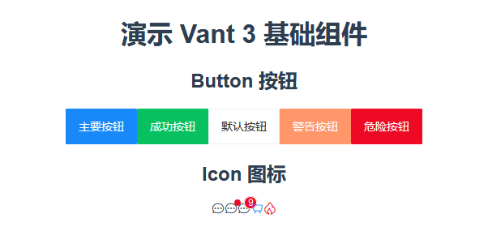

# 项目核心搭建步骤

## 1 安装相关的依赖包

```bash
npm i vant
npm i -D unplugin-vue-components unplugin-auto-import
```

## 2 配置相关的依赖项

配置文件 `vue.config.js`：

```javascript
const { defineConfig } = require("@vue/cli-service");
const AutoImport = require("unplugin-auto-import/webpack");
const Components = require("unplugin-vue-components/webpack");
const { VantResolver } = require("unplugin-vue-components/resolvers");
const path = require("path");

module.exports = defineConfig({
  transpileDependencies: true,
  configureWebpack: (config) => {
    config.plugins.push(
      ...[
        AutoImport({
          resolvers: [VantResolver()],
          dts: path.resolve(process.cwd(), "auto-imports.d.ts")
        }),
        Components({
          resolvers: [VantResolver()],
          dts: path.resolve(process.cwd(), "components.d.ts")
        })
      ]
    );
  }
});
```

## 3 编写测试用代码行

编码文件 `App.vue`：

- 演示 Button 按钮：

```vue
<van-button type="primary">主要按钮</van-button>
<van-button type="success">成功按钮</van-button>
<van-button type="default">默认按钮</van-button>
<van-button type="warning">警告按钮</van-button>
<van-button type="danger">危险按钮</van-button>
```

- 演示 Icon 图标：

```vue
<van-icon name="chat-o" />
<van-icon dot name="chat-o" />
<van-icon badge="9" name="chat-o" />
<van-icon color="#1989fa" name="cart-o" />
<van-icon color="#ee0a24" name="fire-o" />
```

## 4 运行项目查看结果


